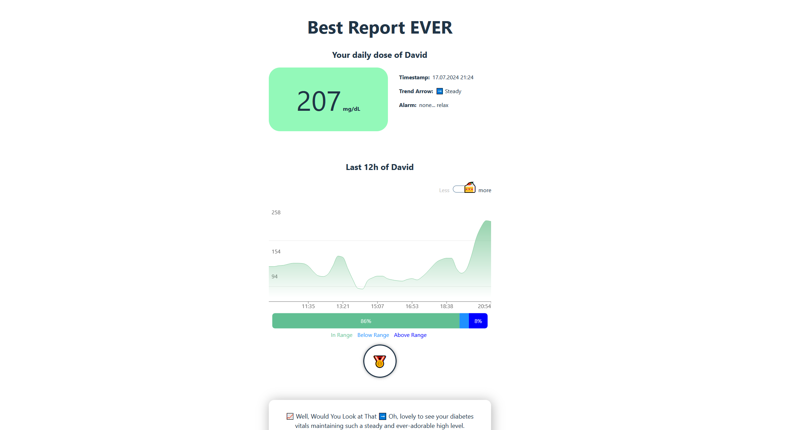

# Vitals Report

Always wanted to keep track on your friend's diabetes vitals?  
Well, same :)



## Table of Contents

- [Getting Started](#-setup)
  - [Prerequisites](#prerequisites)
  - [Environment Variables](#environment-variables)
  - [Data Storage](#data-storage)
- [Run the Project](#-run-the-project)
- [Project Structure](#-project-structure)
- [Tests](#-tests)
- [Built With](#-built-with)

## 🏁 Setup

These instructions will get you a copy of the project up and running on your local machine for development purposes.

### Prerequisites

Make sure you have the following software installed on your machine:

- [Node.js](https://nodejs.org/) (version 21.x or higher)
- [npm](https://www.npmjs.com/) (or [Yarn](https://yarnpkg.com/))
- [Git](https://git-scm.com/)

### Environment Variables 

Create a `.env` file in the root of both the backend (api-proxy) and frontend (web) directories and add the necessary environment variables:
#### Backend  
```js
PORT=5000                                 // if you change the port, remember to change it in the .env file of the frontend, too
API_URL=https://api.example.com           // use a real url of the api where you get the vitals data from (if you don't know, use the dummy data)
OPENAI_API_KEY=your_openai_api_key        // use a real openAI private api key if you have one (if not use the dummy data)
USE_DUMMY_DATA=true                       // set this to false if you want to make the actual api calls. Leave it to true if you want to have the dummy data returned                
EMAIL_SERVICE=gmail                       // your email service (gmail, outlook, yahoo etc)
EMAIL_PASSWORD=your_email_password        // your email password
EMAIL_USER=your@email.de                  // the email you want to send confirmation emails from to the user
JWT_SECRET=jwt_secret_key                 // some random string. (https://dev.to/tkirwa/generate-a-random-jwt-secret-key-39j4)
```    
#### Frontend
```js
VITE_API_URL=http://localhost:5000          // use the real url of where your server is running. If you use the backend you started locally, you can use localhost and the port you chose.
```

### Data Storage 

The Node.js backend persists data simply by storing it into a json file.  
This file is not pushed to github, so we have to create it the first time we set up the backend.  
To do so navigate into the `api-proxy` folder and create an empty `.json` file called `store.json` on the same level es the `index.js` file.     
The `store.json` file will be our simple "database" and is absolutely necessary for the backend.  
> project-root   
> ├── api-proxy  
> │   ├── index.js   
> │   ├── store.json   
> ...

## 🚀 Run the Project

🚨 Install all dependencies with `npm install` in the respective `web` and `api-proxy` folders if you run the api-proxy/frontend for the first time.  

### Backend

There are two "backends". One written in Node.js/Javascript which is maintained by the Frontend Dev for testing and trying out backend development.   
The other one is written in C# and is a more professional approach to implementing the compatible Api.  

#### 1. Api (C#)

... 

#### 2. Api-proxy (Node.js)

Navigate into the `api-proxy` folder and start the server.  
```
cd api-proxy
node index.js
```
if you want the server to restart every time you change something in the backend files, run this instead: 
```
cd api-proxy
npm run server
```
### Frontend

The frontend is a react app running with vite.  
Navigate into the frontend folder, the `web` folder, and run the react app.  
```
cd web
npm run dev
```

## 📂 Project Structure

```js
project-root   
├── api-proxy  // backend api-proxy (Node.js)
│   ├── index.js    // server entry file
│   ├── store.json  // don't forget to create this file, it is not in the gitHub repo because of privacy issues
│   ├── .env        // write your environment varibales here     
│   ├── controllers   // all controllers: logic of the api calls   
│   ├── routes   // all routes of the api that can be used by the frontend   
│   ├── utils   // all utils functions
│   ├── config.json    // put here any global constants
│   ├── package.json    
│   └── ...
├── backend   // backend api (C#)
│   ├── clients
│   ├── configuration
│   ├── controllers
│   ├── models    
│   └── ...    
├── web   // frontend    
│   ├── src
│   │   ├── assets   // put any img, svg etc here
│   │   ├── components   // put any component files here (feel free to nest it further)
│   │   ├── pages   // put any page files here 
│   │   ├── hooks    // put any custom hooks here
│   │   ├── providers    // put any contexts or providers here
│   │   ├── styles    // put any styles of components here
│   │   └── ...    
│   ├── .env    // write your environment varibales here
│   ├── package.json    
│   └── ...    
└── README.md 
```

## 🧪 Tests

### Backend

The Node.js backend has some very basic tests, implemented just for fun and for learning.  
Feel free to check it out on the **node-tests** branch.  

To run the tests simply run
```
npm run test
```

## 🔨 Built With

**Backend**   
- Node.js
- Express
- Jest
- Supertest

**Frontend**
- React
- Vite
- SCSS
- Typescript
- Tanstack Query
- Recharts
- Radix 
